## 2.3&emsp;表の作成とデータの登録
- INSERT INTO `goods`.`goods` (`idgoods`, `goodsname`, `price`) VALUES ('1', 'shirts', '350');
 

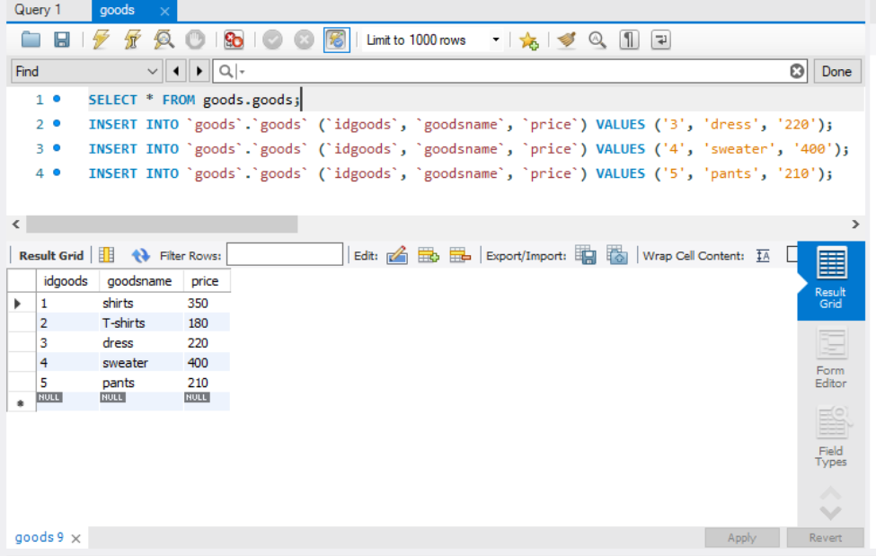 
 
 

## 2.4.2&emsp;列の順序の指定
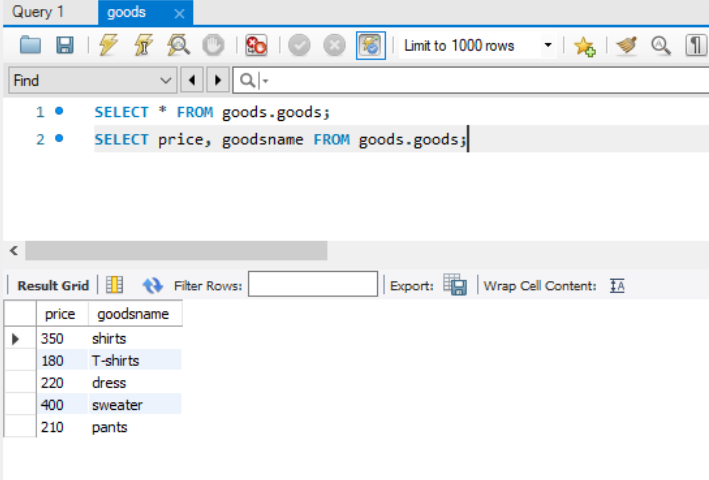 
 
 

## 2.4.5&emsp;検査条件
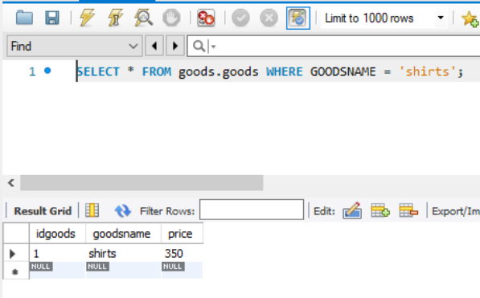 
 
 

# 3.1&emsp;算数演算子
## 3.1.1&emsp;加算(减-&emsp; 乘*&emsp; 除/&emsp; 余%)
- SELECT goodsname,price, price+50 newprice from goods.goods;
 

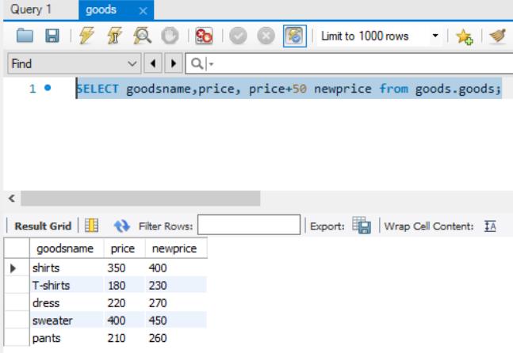 
 
 

# 3.2&emsp;連結演算子
### mysql
- SELECT goodsname,price,concat(goodsname,price) totalinfo from goods.goods;
### Oracle
- SELECT goodsname,price,goodsname || price totalinfo from goods.goods;
 

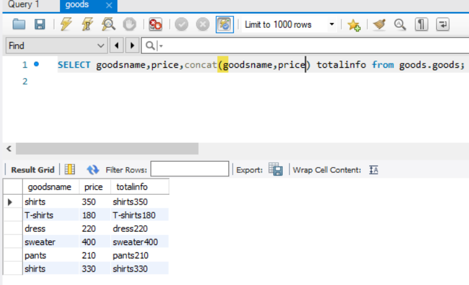 
 

- SELECT goodsname,price,concat(goodsname,',',price) totalinfo from goods.goods;
 

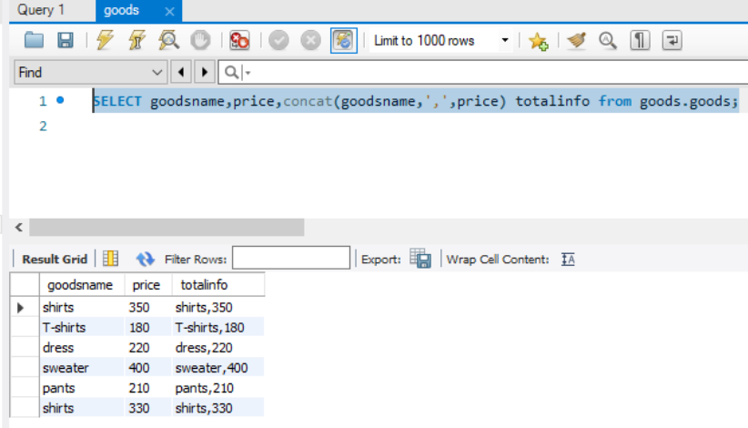 
 
 

# 3.3&emsp;比較演算子
 

## 3.3.3&emsp;<演算子
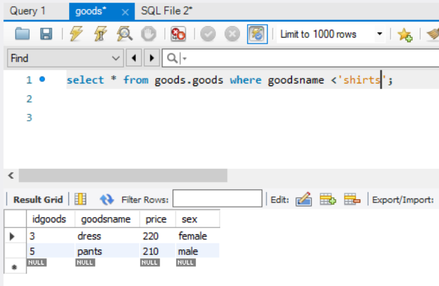 
 

## 3.3.4&emsp;<>演算子
- 表示不包含 &emsp;&emsp;Oracle用的是&emsp;[！=]
- 特定のデータ以外のすべてのデータを取り出す  

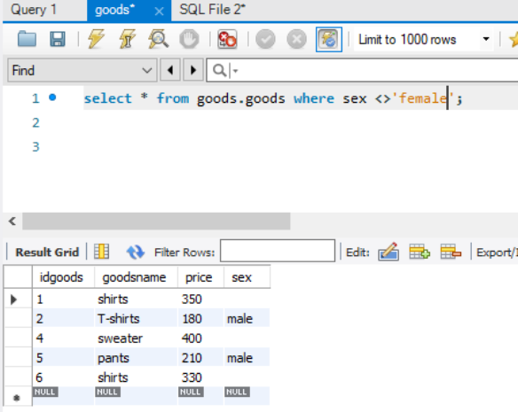 
 
 

## 3.3.5&emsp;NULL&emsp; %&emsp;NOT NULL 
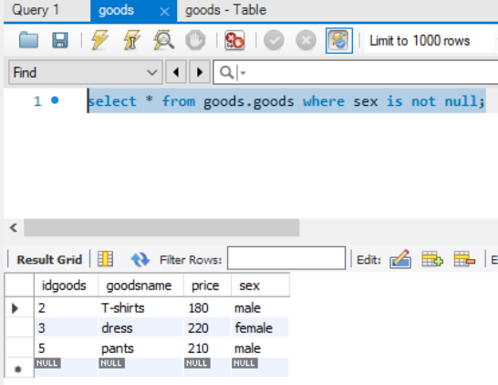 
 

# 4.1&emsp;論理演算子
 

## 4.1.1&emsp;AND演算子
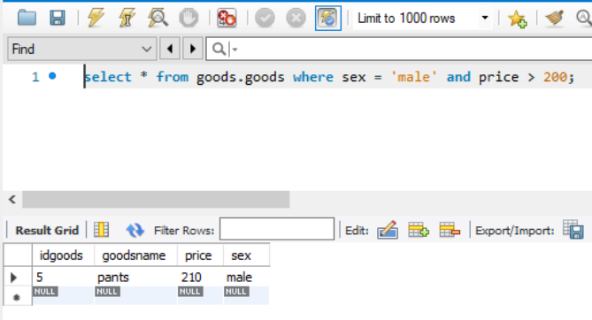 
 

## 4.1.3&emsp;NOT演算子
- この場合には、＝演算子の条件を反転させているので、<>演算子と同じ結果になる。
 

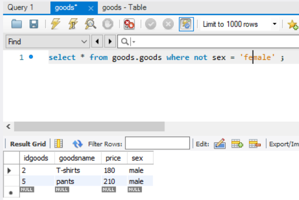 
 
 
 

# 4.2&emsp;LIKE
 

## 4.2.1&emsp;％ワイルドカード
### select * &emsp;FROM &emsp;form1 &emsp;WHERE &emsp; name &emsp; LIKE &emsp;'%E%' ;  
### (模糊查找 百分号内字符无限制)
 

 
 
 

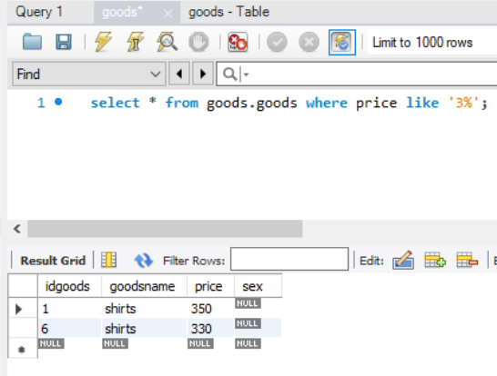 
 
 

## 4.2.2&emsp;_ワイルドカード
### select * &emsp;FROM &emsp;form1 &emsp;WHERE &emsp; name &emsp; LIKE &emsp;'E_'；(模糊查找 _代表任意一个字符)
- 可以使用多个_&emsp;　＇E＿＿＿y'&emsp;和&emsp;'E % y'&emsp;结果相同
- 也可以这样使用&emsp; 'E % y＿'
 

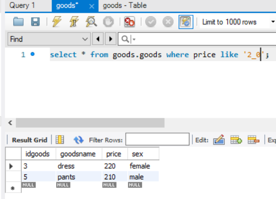 
 
 

## 结合以上两种用法
 

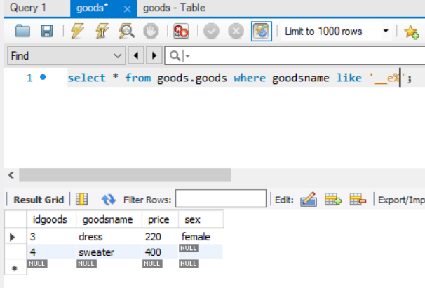 
 
 
 

# 4.3&emsp;IN&emsp;&&emsp;BETWEEN
 

## 4.3.1 &emsp;IN
### IN述語は、指定されたリストの中のいずれかの値が列の値と等しい時に、TRUEを返す。下の方法を書き換えることができる。
- 如果用or方法写

&emsp;&emsp;select *    
&emsp;&emsp;from goods  
&emsp;&emsp;where goodsname = 'shirts'  
&emsp;&emsp;&emsp;&emsp;&emsp;or  
&emsp;&emsp;&emsp;&emsp;&emsp;goodsname = 'dress';  
&emsp;&emsp;会比较繁琐
 
 

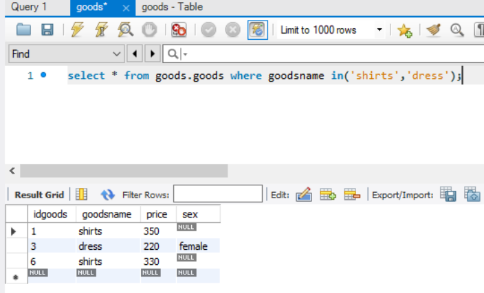
 
 

## 4.3.2 &emsp;BETWEEN
 

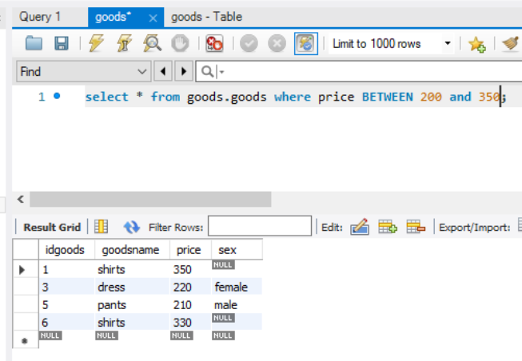 
 
 

- 也可以加NOT  
select * from goods.goods where price NOT BETWEEN 200 and 350;

